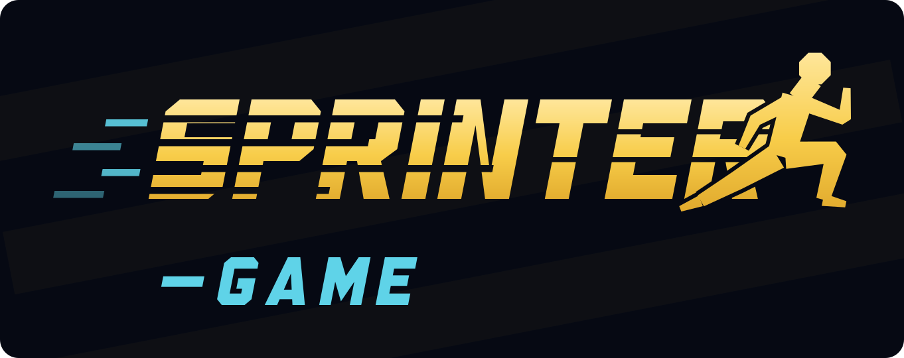

<p align="center">
  
</p>

# Sprinter

Jeu d'athlétisme arcade bilingue (FR/EN) — 100 m et 200 m, six étapes, de la rencontre scolaire à la finale intergalactique. Alternez deux touches (flèches gauche/droite) ou les deux zones tactiles pour sprinter.

Bilingual (FR/EN) arcade sprinting game — 100 m and 200 m, six stages. Alternate two keys (left/right arrows) or the two touch zones to sprint.

## Lancer en local / Run locally

```bash
npm install
npm run dev
```

Puis ouvrez http://localhost:5173

## Build de production / Production build

```bash
npm run build      # génère le site statique dans dist/
npm run preview    # prévisualise le build
```

## Héberger sur GitHub Pages

1. Créez un dépôt GitHub et poussez ce code sur la branche `main`.
2. Dans le dépôt : **Settings → Pages → Source → GitHub Actions**.
3. Le workflow fourni (`.github/workflows/deploy.yml`) construit et publie automatiquement le jeu à chaque push sur `main`. Il définit `BASE_PATH` sur `/<nom-du-repo>/` automatiquement.

Le jeu sera disponible sur `https://<votre-utilisateur>.github.io/<nom-du-repo>/`.

## Contrôles / Controls

- **Flèches gauche/droite** (ou zones tactiles) : courir en alternant
- **L** : changer de langue FR/EN
- Bouton son : couper/activer la musique

## Structure

- `src/game/` — moteur du jeu (physique, rendu low-poly, audio procédural, i18n)
- `src/components/` — interface React (écrans, HUD, contrôles tactiles)
- `public/` — icônes de l'application
- `assets-stores/` — icônes des stores et logo

## Logo

Le logo est vectoriel et se décline en trois fichiers :

| Fichier | Usage |
| --- | --- |
| `assets-stores/logo-sprinter-game.svg` | fond transparent, pour fonds sombres |
| `assets-stores/logo-sprinter-game-fond.svg` | posé sur son propre panneau bleu nuit — README, réseaux, stores |
| `assets-stores/logo-sprinter-game-mono.svg` | une seule couleur, pour fonds clairs et impression |

Les lettres sont dessinées en chemins, sans dépendre d'une police installée. Pour
retoucher la composition (pente de l'italique, position du coureur, fentes de
vitesse), modifiez `tools/logo-generer.mjs` puis :

```bash
node tools/logo-generer.mjs
```
