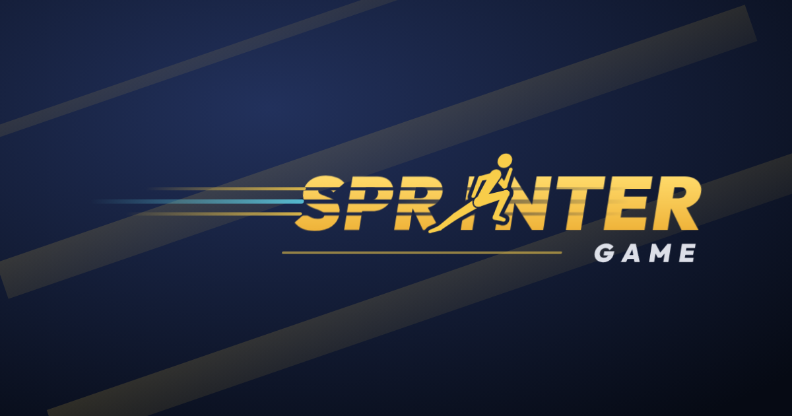

# Le logo

Le coureur prend la place du **I** de SPRINTER : ce n'est pas un pictogramme
pose a cote du mot, c'est le mot lui-meme qui court. Trois choses portent la
vitesse, et elles se tiennent :

- le mot penche de 9 degres, coureur compris — la silhouette gagne d'autant en
  attaque ;
- des entailles horizontales creusent les lettres a l'arriere, puis s'effacent
  vers l'avant : le mot se defait la ou il vient de passer et redevient net la
  ou il va ;
- des trainees filent derriere le S, dans la meme trame que les entailles.

Le fut du I reste dessine derriere le coureur. C'est ce qui permet de garder le
mot lisible quand la silhouette n'est plus qu'une tache : sans lui, un logo de
120 px de large se lit SPRNTER.

Le vide autour du coureur est un **vrai trou** dans les lettres, pas un contour
peint de la couleur du fond. Le logo se pose donc sur ce qu'on veut — une
photo, un aplat, un degrade — sans laisser de halo.

## Les fichiers

| Fichier | Quand s'en servir |
| --- | --- |
| `logo-sprinter-game.svg` / `.png` | Version principale. Fond sombre (le bleu de nuit du jeu, `#0a0f1c`), ou n'importe quel fond fonce. |
| `logo-sprinter-game-fond-clair.svg` / `.png` | Fond blanc ou tres clair : les lettres passent a l'encre bleu nuit, le coureur garde l'or. |
| `logo-sprinter-game-une-encre.svg` | Une seule encre sombre. Impression noir et blanc, tampon, gravure, fax du siecle dernier. |
| `logo-sprinter-game-une-encre-blanche.svg` | Une seule encre blanche : sur l'or de la marque, sur une photo, sur un textile fonce. |
| `banniere-sociale-1200x630.svg` / `.png` | L'apercu des liens partages (Open Graph, cartes Twitter, Discord). 1200x630, la taille que ces services reclament. |

Les PNG sont fournis a fond transparent pour les outils qui ne savent pas lire
un SVG. Partout ailleurs, prendre le SVG : il est net a toutes les tailles et
pese vingt fois moins.

## Les couleurs

| Role | Valeur |
| --- | --- |
| Or (lettres, coureur) | `#F8CD4A`, degrade `#FFDA6A` → `#EDAE33` |
| Cyan (une trainee sur trois) | `#5FD3E8` |
| Encre, fond clair | `#0B1120` |
| GAME, fond sombre | `#EEF0F8` |
| Fond de reference | `#0a0f1c` |

Ce sont celles du jeu : `--primary` et `--background` de `src/index.css`.

## Ce qui ne se touche pas

- **La zone de respect** : garder autour du logo au moins la hauteur du mot
  GAME. Les trainees en font partie — les recadrer les transforme en rayures.
- **La taille minimale** : 140 px de large a l'ecran, 40 mm a l'impression. En
  dessous, les entailles se referment et le coureur devient une tache.
- Ne pas redessiner le mot avec la police : les lettres sont **converties en
  courbes**, et l'entaille comme le trou du coureur sont solidaires du dessin.
- Ne pas etirer, ne pas redresser, ne pas changer les couleurs de l'or : les
  quatre habillages ci-dessus couvrent les cas rencontres.

## D'ou viennent les lettres

Outfit 900 — la police d'affichage du jeu, celle de `--font-display` — dont les
glyphes ont ete convertis en courbes. Aucun fichier de police n'est donc
necessaire pour afficher le logo, et il ne peut pas se substituer une autre
police au passage. Outfit est publiee sous licence SIL Open Font License 1.1,
qui autorise cet usage.

Le coureur, lui, est dessine pour ce logo : des membres en troncs de cone, plus
larges a la racine qu'a l'extremite. L'icone 24 px du jeu (`public/favicon.svg`)
montrerait ses angles des qu'on la tirerait a cette taille.
